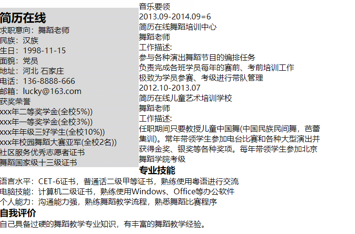

### 使用浮动来实现两栏布局
问题描述： 

浮动之后，左侧栏的高度比右侧栏的高度低，导致右侧栏的部分内容放置在左侧栏的下面



如何解决：

左右区域的内容都要一起浮动，例如：

```css
.left-aside{
    max-width: 30%;
    float: left;
}
.right-aside{
    max-width: 70%;
    float: right;
}
```

### html是什么，html5是什么？
html: HTML（HyperText Markup Language，超文本标记语言） 是一种描述语言，用来定义网页结构。

html5: HTML 的最新稳定版本, HTML5 将 HTML 从用于构造一个文档的一个简单标记，到一个完整的应用程序开发平台。除其他功能外, HTML5 还包括新元素和用于增强存储、多媒体和硬件访问的JavaScript APIs 

### html元素标签、属性是什么？

html标签：html页面由许多内容组成，每一种内容用一个html标签进行表示，比如一个段落可以用p元素进行标识、一个链接可以用a标签进行标识，每一个html标签表示不同的使用场景。

html标签的属性：包含了标签元素的额外信息，比如：

```html
<a href="www.baidu.com" title="链接到百度">百度</a>
```


### 文档类型是什么概念，起什么作用？

在[HTML](https://developer.mozilla.org/en-US/docs/Glossary/HTML)中，文档类型声明是必要的。所有的文档的头部，你都将会看到"`<!DOCTYPE html>`" 的身影。这个声明的目的是防止浏览器在渲染文档时，切换到我们称为“[怪异模式(兼容模式)](https://developer.mozilla.org/zh-CN/docs/Web/HTML/Quirks_Mode_and_Standards_Mode)”的渲染模式。“`<!DOCTYPE html>`" 确保浏览器按照最佳的相关规范进行渲染，而不是使用一个不符合规范的渲染模式。


### meta标签都用来做什么的？

该元素可提供有关页面的元信息（meta-information），比如针对搜索引擎和更新频度的描述和关键词。


### Web语义化是什么，是为了解决什么问题

让搜索引擎更好更快地读懂人们在web上发布的内容。

在web上发布内容时，应该用机器可读的、被人们广泛认可的语义来描述内容信息，来降低机器处理内容的难度。


### 链接是什么概念，对应什么标签？

链接是用来跳转到另一个地方(可以在同一服务器下，也可以在不同服务器下)，用a标签来表示


### 常用标签都有哪些，都适合用在什么场景

| 分类     | 标签                  | 场景                                                   |
| -------- | --------------------- | ------------------------------------------------------ |
| 文档结构 | h1~h6                 | 标题                                                   |
|          | header                | 页面标题                                               |
|          | nav                   | 导航栏                                                 |
|          | main                  | 内容主体                                               |
|          | article               | 表示文章区域                                           |
|          | section               | 文档或应用中一个一般的区块，即表示页面中一个特定的区块 |
|          | aside                 | 表示附注栏                                             |
|          | footer                | 页面或文章的页脚                                       |
|          | div                   | 一个通用的容器，表示一个无语义的块级内容               |
| 文本     | p                     | 表示一个段落                                           |
|          | small                 | 行内文本中的一小块，指定细则                           |
|          | strong                | 标记重要                                               |
|          | em                    | 强调的文本                                             |
|          | cite                  | 指明对某内容源的引用或参考                             |
|          | blockquote            | 引述文本                                               |
|          | time                  | 指定时间                                               |
| 图片     | figure                | 创建图                                                 |
|          | figcaption            | 图题                                                   |
|          | img                   | 引入图片                                               |
| 链接     | a                     | 指定另一个页面                                         |
| 列表     | ul                    | 无须列表                                               |
|          | ol                    | 有序列表                                               |
|          | li                    | 列表项                                                 |
| 表单     | form                  | 创建一个表单                                           |
|          | input type="text"     | 文本框                                                 |
|          | label                 | 描述表单字段用途的文本                                 |
|          | input type="password" | 创建密码框                                             |
|          | input type="email"    | 邮件框                                                 |
|          | input type="search"   | 搜索框                                                 |
|          | input type="tel"      | 电话框                                                 |
|          | input type="url"      | url框                                                  |
|          | input type="radio"    | 创建单选按钮                                           |
|          | checkbox              | 复选框                                                 |
|          | select                | 选择框                                                 |
|          | input type="file"     | 上传文件                                               |
|          | input type="hidden"   | 创建隐藏字段                                           |
|          | input type="submit"   | 创建提交按钮                                           |
| 视频音频 | video                 | 在网页中添加单个视频                                   |
|          | audio                 | 在网页中添加单个音频文件                               |
| 表格     | table                 | 创建表格                                               |
|          | caption               | 表格描述                                               |
|          | thead                 | 显式地将一行或多行标题标记为表格的头部                 |
|          | tbody                 | 用于包围所有的数据行                                   |
|          | tfoot                 | 显式地将一行或多行标记为表格的尾部                     |
|          | tr                    | 一行                                                   |
|          | td                    | 一行中的单元格                                         |
|          | th                    |                                                        |
|          |                       |                                                        |
|          |                       |                                                        |


### 表单标签都有哪些，对应着什么功能，都有哪些属性

| 标签     | 属性                                                        | 功能                   |
| -------- | ----------------------------------------------------------- | ---------------------- |
| form     | action、method                                              | 创建一个表单           |
| fieldset |                                                             | 组织表单元素           |
| legend   |                                                             | 表单元素描述性文字     |
| input    | type、name、placehold、required、autofocus、size、maxlength | 输入框                 |
| label    | for                                                         | 描述表单字段用途的文本 |


### ol, ul, li, dl, dd, dt等这些标签都适合用在什么地方，举个例子

| 标签元素 | 功能       |
| -------- | ---------- |
| ol       | 有序列表   |
| ul       | 无须列表   |
| li       | 列表项     |
| dl       | 自定义列表 |
| dt       | 定义项目   |
| dd       | 定义描述   |

```html
<dl>
	<dt>Coffee</dt>
	<dd>Black hot drink</dd>
	<dt>Milk</dt>
	<dd>White cold drink</dd>
</dl>
```

